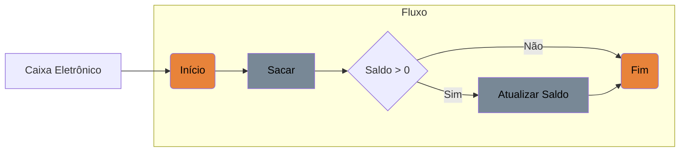
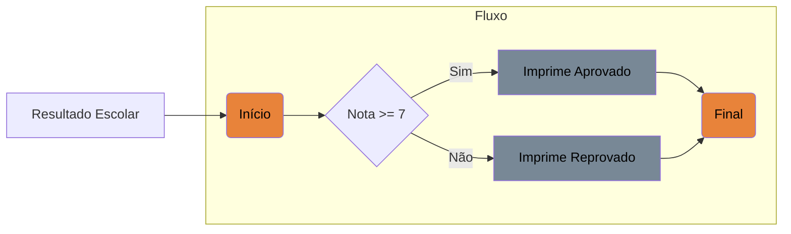
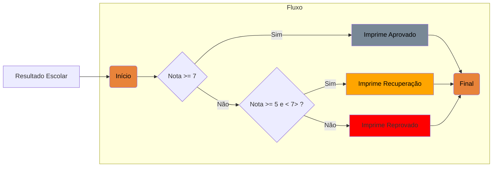

# Controle de Fluxos

Essa parte dos estudos é para praticar e aprofundar o conhecimentos em:

- [x] Estruturas condicionais: ```if-else, switch-case.```

- [x] Estruturas de repetição: ```for, while, do-while.```

- [x] Estruturas de exceções: ```try-catch-finally, throw.```


## Estruturas condicionais

### Simples

Para praticar foi criado o projeto simples aonde temos um caminho caso a condicional seja verdadeiro. 
Para simular uma aplicação de saque:



### Compostas

O processo condicinal composto é quando pode acontecer duas ou mais ações diferentes dependo do resultado.

O fluxo diagrama abaixo mostra a nota dependo se é maior que 6 para o resultado ser aprovado :



### Encadeadas

O processo de fluxo pode conter mais de uma condicional dentro de outra.



### Ternária

Server para reduzir o tamanho de uma condicional, quando ela dever fazer apenas uma ação exemplo trazer o resultado se o alunos está aprovado.

### Switch Case

Quando eu tenho uma variávei e posso ter varias rotas caso o tenha um valor definido com verdadeiro.
Esse modo é menos "verboso" do que o procedimento do ```if e else if```.

## Estrutura de repetição

Laços de repetição, também conhecidos como laços de iteração ou simplesmente loops, são comandos que permitem iteração de código, ou seja, que comandos presentes no bloco sejam repetidos diversas vezes.

- [Documentação de repetições](https://diegomariano.com/lacos-de-repeticao-2/)


### FOR (para)


### WHILE (enquanto)

### DO WHILE (faça enquanto)