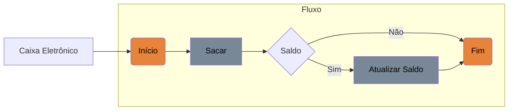

# Controle de Fluxos

Essa parte dos estudos é para praticar e aprofundar o conhecimentos em:

- [ ] Estruturas condicionais: ```if-else, switch-case.```

- [ ] Estruturas de repetição: ```for, while, do-while.```

- [ ] Estruturas de exceções: ```try-catch-finally, throw.```


## Estruturas condicionais

Para praticar foi criado o projeto simples para simular uma aplicação de saque:



