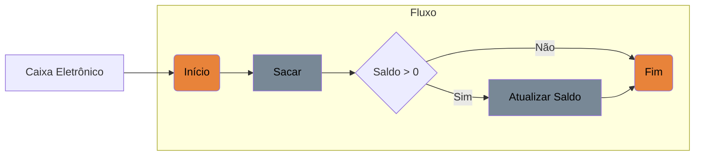
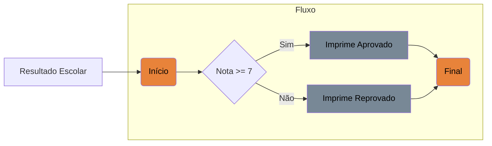

# Controle de Fluxos

Essa parte dos estudos é para praticar e aprofundar o conhecimentos em:

- [ ] Estruturas condicionais: ```if-else, switch-case.```

- [ ] Estruturas de repetição: ```for, while, do-while.```

- [ ] Estruturas de exceções: ```try-catch-finally, throw.```


## Estruturas condicionais

### Simples

Para praticar foi criado o projeto simples aonde temos um caminho caso a condicional seja verdadeiro. 
Para simular uma aplicação de saque:



### Compostas

O processo condicinal composto é quando pode acontecer duas ou mais ações diferentes dependo do resultado.

O fluxo diagrama abaixo mostra a nota dependo se é maior que 6 para o resultado ser aprovado :




